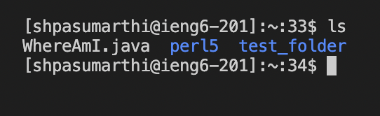

# Lab Report 1, Week 1
## 1. Installing VS Code

* Go to [VS Code Website](https://code.visualstudio.com/) and click the download link for your operating system
* Once the download is complete, open up the app
## 2. Remotely Connecting

* Open up the command prompt using Command + \` or Control + ` if I are on PC
* Type in ssh \<Ir username>@ieng6.ucsd.edu
* If this is your first time connecting to the server, you may get a warning that the authenticity of the host server can't be established. Click yes to continue connecting
* I then logged into the system and got a screen similar to the one below

* I was unable to get my cs15lfa22 account to work so I used my active directory account instead

## 3. Trying Some Commands
* Now that we're logged in we can try out some commands!
* First, I can see what directory I'm in using the `pwd` command
* Then I typed `cd ` or `cd ~` to navigate to my home directory. If I wasn't in my home directory earlier, I should be able to see that my working directory is now different if I run the `pwd` command
* I can use the `ls` command to print out the documents and directories in my working directory
* I can also use cd <directory path> to change my working directory to a desired directory
## 4. Moving files with scp
* First, I got out of ssh using the `logout` command. Alternatively, I could click the plus icon on the top right side of the command window to open up a new terminal
* Then I got a file that I would like to copy over to the server. I am going to be using WhereAmI.java
* I typed in scp \<name of Ir file> <username>@ieng6.ucsd.edu:\<file path I would like the copied file to be in on the server>
* I then had to login to the server using my password. I did so and then the file transfered.
* I then logged back into the server using ssh and used the cd and ls commands to see if the file was moved over. 
* Here are some screenshots of the process:

## 5. Setting an SSH key

* I then setup an ssh key to use a pair of files instead of a password to make logging in easier
* I ran the `ssh-keygen` command to generate a key pair
* I entered a file to save the key in. Typed enter to use a default path
* Entered my passphrase and then my identification was saved and my key was saved
* I then "scp'ed" the public key to the server to my ssh directory on the server to complete the process. I ran a command similar to the user agnostic command below (you can use this): `scp <public key path> <username>@ieng6.ucsd.edu:~/.ssh/authorized_keys` to finish the process. 

## 6. Optimizing Remote Running
* I then used some command tricks to make using the terminal even more pleasant. I can use quotes around a command to run a command on the remote server and then immediately log out using similar code to the following: `ssh <username>@ieng6.ucsd.edu "<command>"`. I can also use semicolons to run multiple commands on one line like the following: `command1; command2; command3`
* My final code was the following: `scp WhereAmI.java shpasumarthi@ieng6.ucsd.edu:~/; ssh shpasumarthi@ieng6.ucsd.edu "javac WhereAmI.java"; ssh shpasumarthi@ieng6.ucsd.edu "java WhereAmI.java"

* I run the code once before I make any edits. After I make an edit and save, I can use the up arrow to run the code in one click and one press of the enter key. This is very useful if I'm actively coding and want to try running the java code on the server for debugging or testing reasons.
