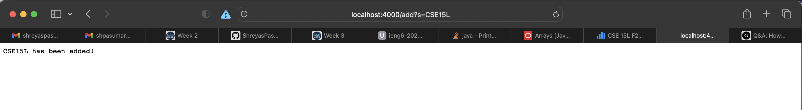
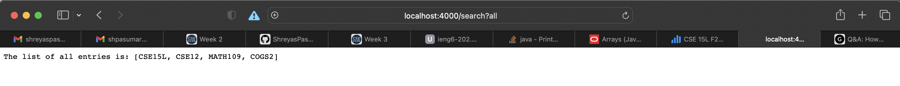
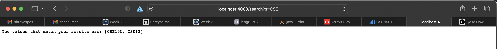

# Lab Report 2, Week 3
# Part 1
## 1. Code
```
import java.io.IOException;
import java.net.URI;
import java.util.ArrayList;
import java.util.Arrays;

class Handler implements URLHandler {
    ArrayList<String> list = new ArrayList<String>();

    public String handleRequest(URI url) {
        if (url.getPath().equals("/")) {
            return String.format("Make a search!");
        } else if (url.getPath().contains("/add")) {
                String[] parameters = url.getQuery().split("=");
                if (parameters[0].equals("s")) {
                    list.add(parameters[1]);
                    return String.format("%s has been added!", parameters[1]);
                }
        } else if (url.getPath().contains("/search")) {
            String[] parameters = url.getQuery().split("=");
            if (parameters[0].equals("s")) {
                ArrayList<String> returnList = new ArrayList<String>();
                for (int i = 0; i < list.size(); i++) {
                    if (list.get(i).contains(parameters[1])) {
                        returnList.add(list.get(i));
                    }
                }
                return "The values that match your results are: " + Arrays.toString(returnList.toArray());
            } else {
                if (parameters[0].equals("all")) {
                    return "The list of all entries is: " + Arrays.toString(list.toArray());
                }
            }
        }
        return "404 Not Found!";
    }
}


public class SearchEngine {
    public static void main(String[] args) throws IOException {
        if(args.length == 0){
            System.out.println("Missing port number! Try any number between 1024 to 49151");
            return;
        }

        int port = Integer.parseInt(args[0]);

        Server.start(port, new Handler());
    }
}
```
## 2. Screenshots
---

The handleRequest() method is called and the argument to the method is the url including and after the first / which in this case, is add?s=CSE15L. This query is processed and the string "CSE15L" is added to an ArrayList<String> called list that contains all of the strings added. Since this is the first time something was added, the ArrayList became instantiated and the string "CSE15" was added.
---

The handleRequest)() method was called with the input "/search?all". Since the url contained the key search, the code looked for the query which was all and then because the query was all, returned the string values of all the elements in the list ArrayList. 
---

The handleRequest() method was called with the argument /search?s=CSE. Since the url contained the keyword search, the query was checked and since the query contained the s=, the string "CSE" was searched for in all strings in the list ArrayList. If the char sequence "CSE" was found in a string in list, that value was appended to a new list, which was converted to a string at the end and returned. 

---
# Part 2

## Bug 1 - Array reverseInPlace()
---
The failure inducing input was: {1, 2, 3}. 
My test code was : 
```
 @Test
 public void testReversedIPMult() {
   int[] input = {1, 2, 3};
   ArrayExamples.reverseInPlace(input);
   assertArrayEquals(new int[]{3,2,1}, input);
 }
 ```

The symptom was that the array ended with a 3 instead of a 1. This can be seen in the error message below
```
1) testReversedIPMult(ArrayTests)
arrays first differed at element [2]; expected:<1> but was:<3>
```

The bug in the code was that the code would use the index of an element that had already been reversed to reverse the array. For example, the array {1,2,3} had been changed to {3,2,3} and the last element 3 needed to be reversed. The code would make arr[2] = arr[1], which is now 3 instead of 1 because the code had already been run on arr[1]. This is why the bug caused the symptom of the array being {3, 2, 3} when returned instead of {3, 2, 1}

The code fix I did is below:
```
 // Changes the input array to be in reversed order
 static void reverseInPlace(int[] arr) {
   for(int i = 0; i < arr.length/2; i += 1) {
     int temp = arr[i];
     arr[i] = arr[arr.length - i - 1];
     arr[arr.length - i - 1] = temp;
   }
 }
  ```

## Bug 2
---

The failure-inducing input for this test was a list that contained {"himinion, "byeminion", "hibye"} and a StringChecker that checked whether a string contained the string "minion" or not. 

The symptom was that the test failed and the returned array was {"byeminion", "himinion"} instead of {"himionion", "byeminion"}. The test failed because the order was not preserved.

The bug was that the elements are inserted into the front of the result ArrayList at all times, which means that the order is not preserved. This resulted in the test array being in flipped order and therefore, caused the symptom.