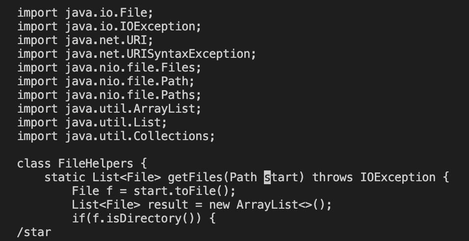
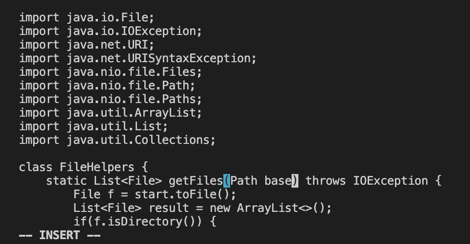
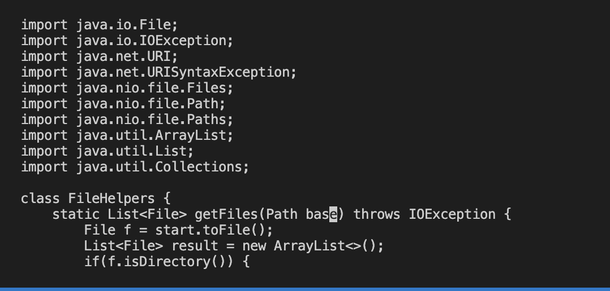
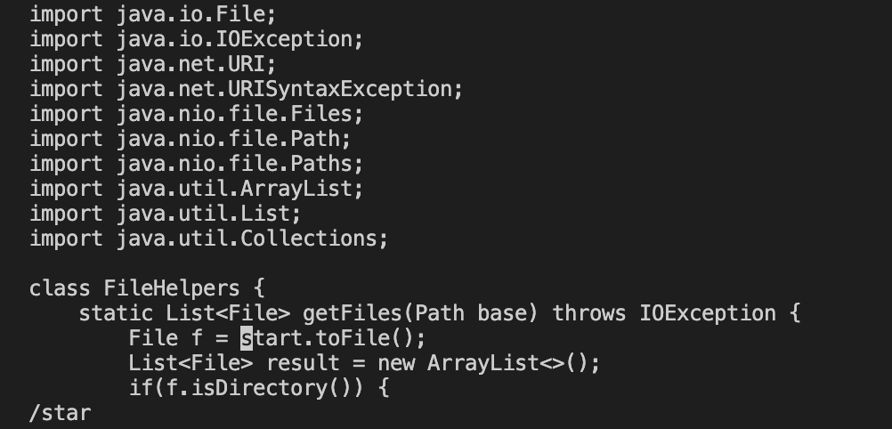
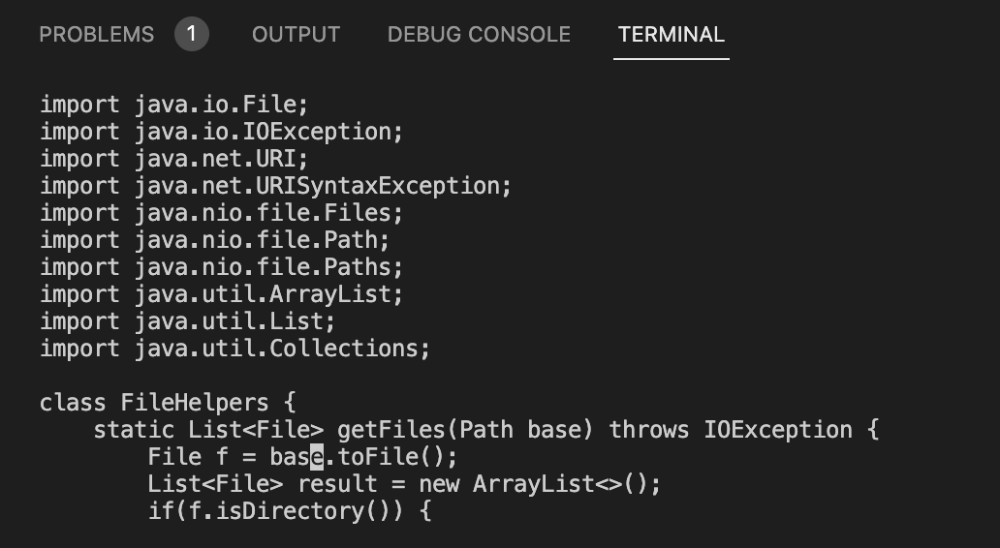
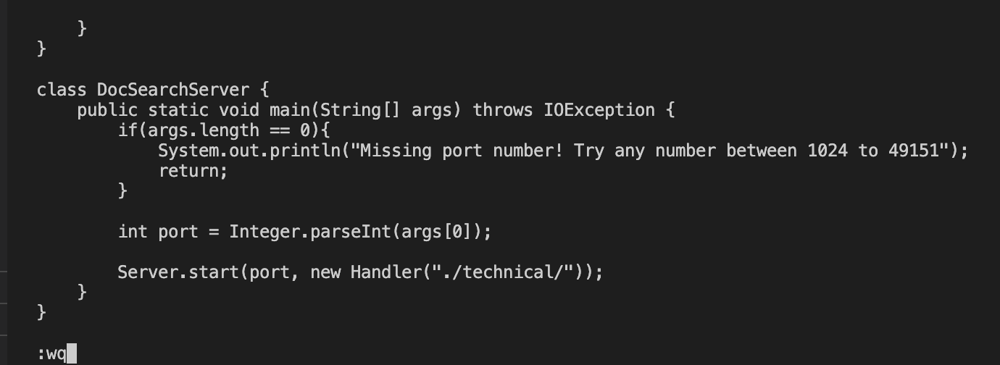

# Lab Report 2, Week 3
# Part 1
## Code
`/star<Enter>cebase<Esc>n.n.:wq`

## /star < Enter >
Typed /star and < Enter>to search for 'star' in the file

Searching for 'star'

## ce then switching
Typed ce which changes the mode to insert mode and deletes the word 'start' and changes it to 'base' when I typed base

Typing ce to get into insert mode and base to switch 'start' to 'base'

Typing <Esc> to exit out of insert mode

## doing n. twice
Did n. twice which changed 'start' to 'base' for the remaining 2 instances of 'start'

Typing n to move to next instance of 'start'

Typing . to change 'start' to 'base'

## :wq
Typed :wq to save and quit

Typing :wq

Screen after quitting

# Part 2
Style 1: 1:41
Style 2: 1:08
I had no difficulties in Style 2 but Style 2 took a bit longer than usual to send over to the server.

1. Which of these two styles would you prefer using if you had to work on a program that you were running remotely, and why?
* I would prefer to start logged into ssh because if I'm only running this program remotely, it saves time to write and test the program while logged into ssh because I don't have to spend time scp'ing the file over to the remote every time I want to run my code.

2.  What about the project or task might factor into your decision one way or another? (If nothing would affect your decision, say so and why!)
If I have to continually check that the code I'm writing works on both the local machine and the server, then I would write and run on the local and run tests on the server using scp. I would also write on the local and run on the server if I had a project where my local computer had software, files, or tools that the server did not that make development in the project easier and/or when the project needs unique files, tools, or computing capacity only on the server to run. Then assuming that the server can run the code without the files, software, or tools that the laptop has, it would make sense to edit in the local computer and run in the server. In other cases, I would be highly likely to prefer sshing into the machine and coding there.
